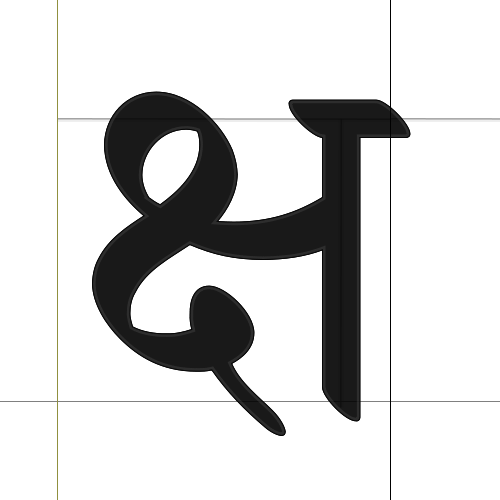

### Related documentation
- [FontForge Tutorial](https://fontforge.org/docs/tutorial.html)

### Building stages 

- Use the source `.sfd`
>

- Build all glyphs, or only selected glyphs, specifying the desired brush shape 
> + 

- Checking the results
>

- Generate `.ttf` (File -> Generate Fonts..., Generate)
>
