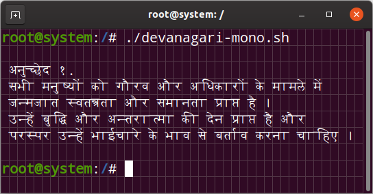

# The Monotty font project
### Monospaced fonts for terminals with CTL support

__Monotty__ is shortening for for two words: `Monospaced` and `TTY` (Teletype, Terminal).

Example of output  

These fonts are mainly intended for experiments with displaying CTL scripts in terminal emulators supporting the character slicing. (See [the new SGR attribute](https://gitlab.freedesktop.org/terminal-wg/specifications/-/issues/23)). This font has not been finalized to the level of practical use, and so far it contains some inaccuracies that are not critical for the experiments.

### Writing systems
- [ ] [Brahmic scripts](https://en.wikipedia.org/wiki/Brahmic_scripts)
  - [x] Devanagari `<dev2>`
    - [x] Nepali `<NEP >`
    - [x] Marathi `<MAR >`
  - [ ] Bengali `<bng2>`
  - [ ] Gujarati `<gjr2>`

## Specification
- Font type: outline (automatic generation from strokes, stroke-based representation, expresses each glyph as a set of stems)
- Weight: configurable stroke width
- Em size: 2000
- Сharacter width: monospaced, exactly 1/2em
- Ascent: 1400
- Descent: 600

## Build

The font binaries are not directly part of this repository, as it only contains source files; however, the binaries are directly built from the `.sfd` files. This requires the [FontForge Monotty Edition](https://github.com/monotty/fontforge).

Building the font (e.g. generate the `.ttf` file) from source

[BUILD.md](/BUILD.md)

### Download

 - Devanagari `<dev2>`: [`monotty-dev2.ttf`](.resources/monotty-dev2.ttf)
 - Bengali `<bng2>`: N/A
 - Gujarati `<gjr2>`: N/A
